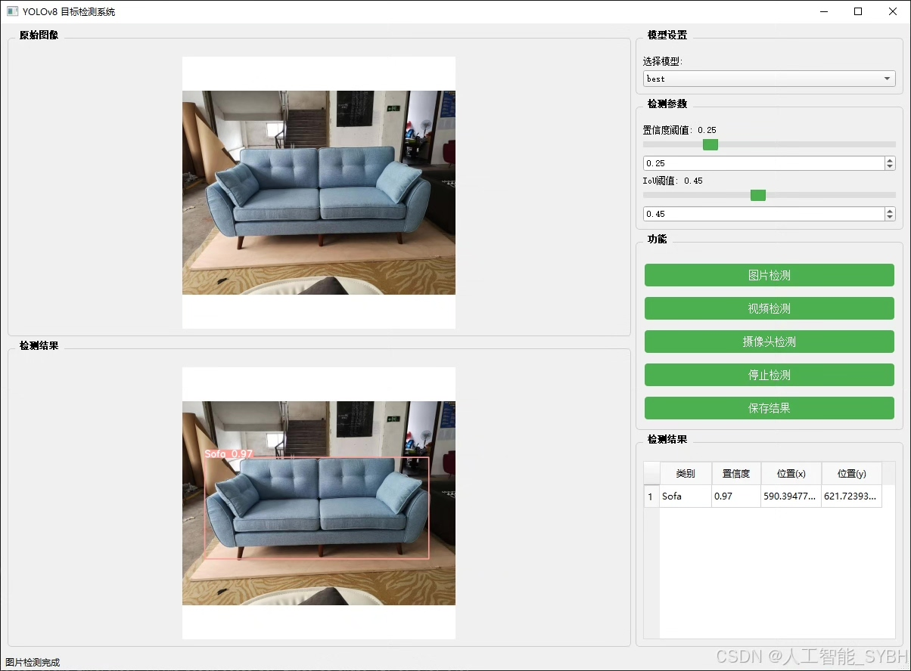
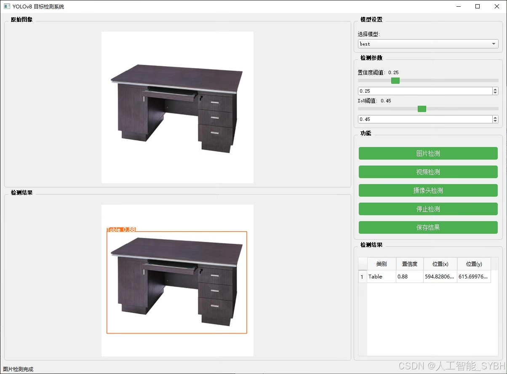
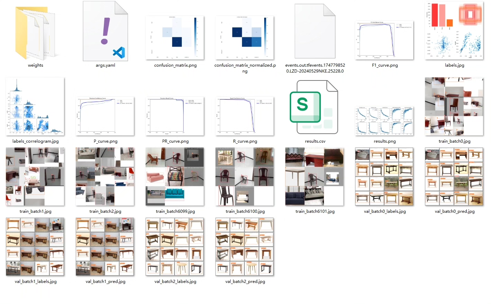
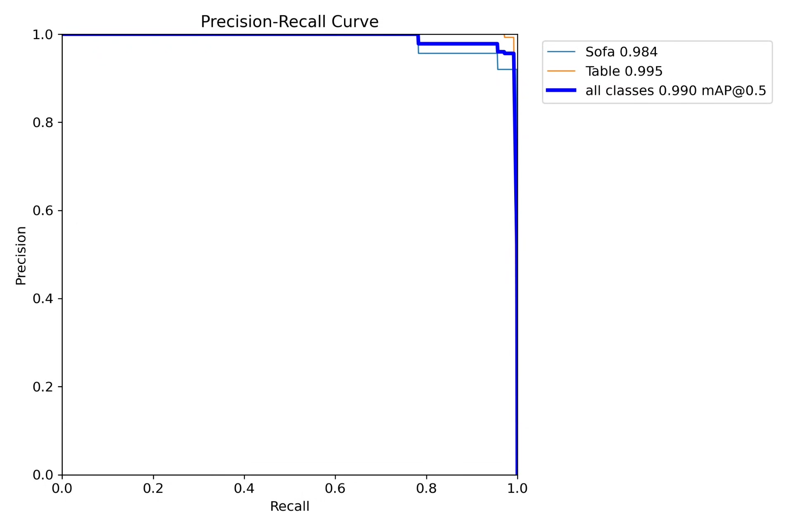
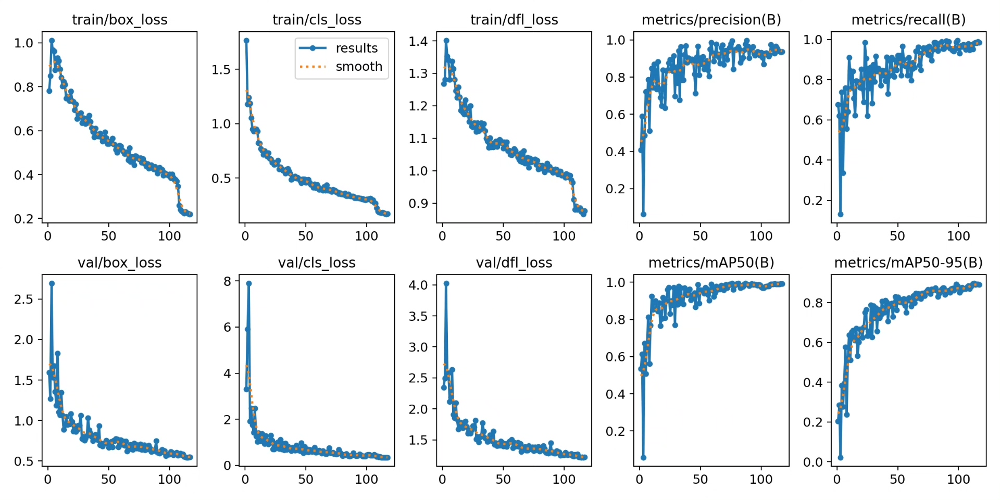
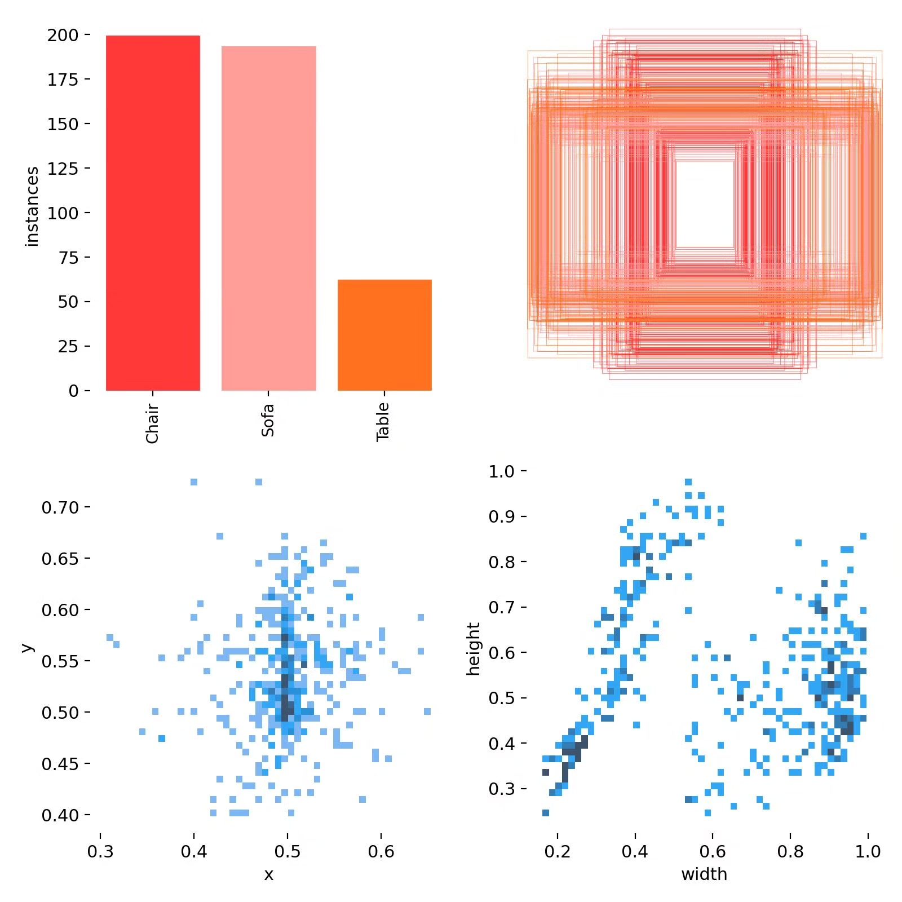
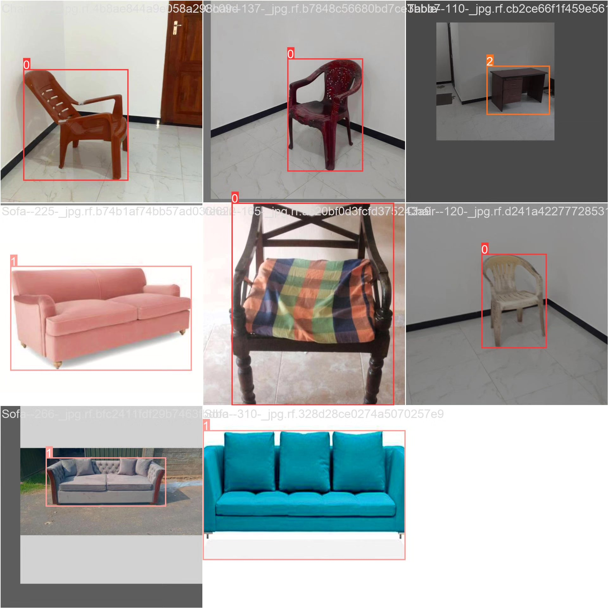
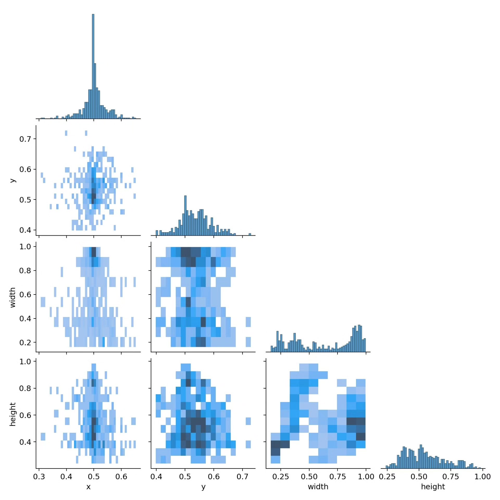

# Based on Deep Learning YOLOv8 for Furniture Recognition and Detection System (YOLOv8+Y)

## Body

This project is based on the advanced YOLOv8 object detection algorithm, developing a smart visual system specifically for furniture recognition. The system efficiently recognizes and locates three common types of furniture (chairs, sofas, and tables) using 689 labeled images as a dataset. Through deep learning technology, the system can accurately detect furniture items in image or video streams and label their categories and locations. The project implements a complete process from data collection, annotation, model training to performance evaluation, achieving high recognition accuracy on the test set and providing reliable technical solutions for applications such as smart home, indoor navigation, furniture e-commerce, etc.

The company's products have obtained YOLO official commercial license certification.

We provide after-sales service.

After payment, we will provide WeChat ID for any questions.

Environment configuration: We will provide an environment configuration tutorial, and WeChat will provide answers.

Remote installation service: If you need remote configuration, an additional fee of 69 is required.
If the configuration fails, all fees will be refunded (specially for old computers only refund installation fees).

Retraining dataset: After setting up the environment, you can train on your own computer.
If you need us to retrain, just pay 69 + computing power fees (2.5 yuan/hour).

Full after-sales service

## Images

## Payment

Here is a pay link on Stripe ( https://buy.stripe.com/3cs8yP7sY87d0vu9AB ). Please contact me lonlonago@foxmail.com after funding $89, and I will send you a complete data files , thank you!

